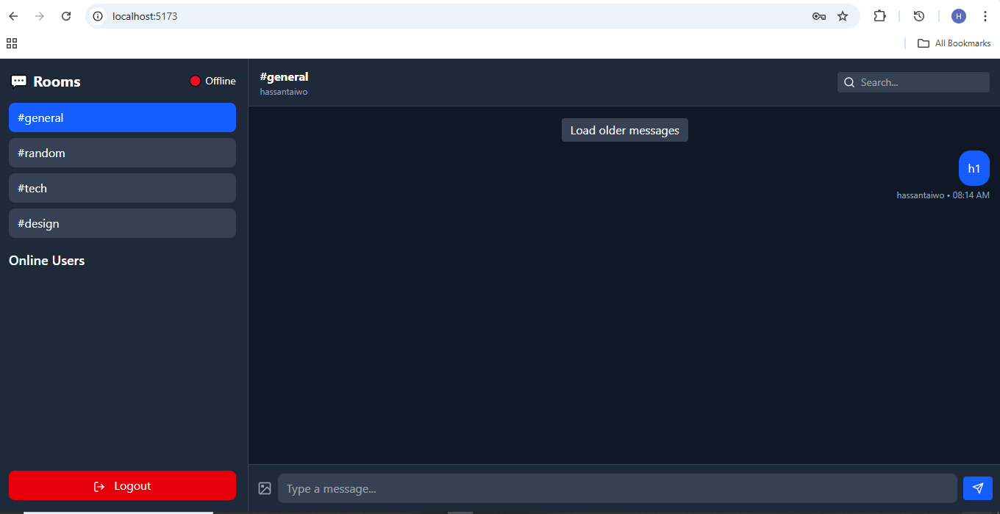
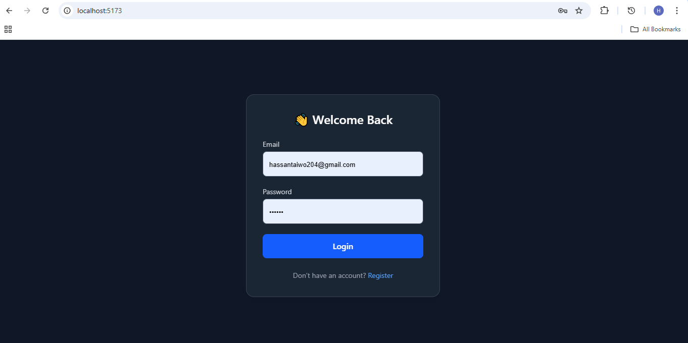

# Real-Time Chat Application 💬

A modern, feature-rich real-time chat application built with React, Node.js, Socket.IO, and MongoDB. Supports multiple chat rooms, file sharing, typing indicators, and message persistence.

---

## ✨ Features

- **Real-time Messaging**: Instant message delivery using Socket.IO
- **Multiple Chat Rooms**: Join different rooms (general, random, tech, design)
- **User Authentication**: Secure registration and login with JWT
- **File Sharing**: Upload and share images in chat
- **Typing Indicators**: See when other users are typing
- **Message Persistence**: All messages stored in MongoDB
- **Message Pagination**: Load older messages on demand
- **Search Functionality**: Search messages by content or sender
- **Online Users List**: See who's currently online
- **Unread Message Badges**: Track unread messages per room
- **Sound Notifications**: Audio alerts for new messages
- **Responsive Design**: Works on desktop and mobile devices
- **Connection Status**: Visual indicator for online/offline status

---

## 🛠️ Tech Stack

### Frontend
- **React** - UI library
- **Vite** - Build tool
- **Tailwind CSS** - Styling
- **Socket.IO Client** - WebSocket communication
- **Axios** - HTTP requests
- **React Icons** - Icon library

### Backend
- **Node.js** - Runtime environment
- **Express** - Web framework
- **Socket.IO** - Real-time bidirectional communication
- **MongoDB** - Database
- **Mongoose** - MongoDB ODM
- **JWT** - Authentication
- **Multer** - File upload handling
- **bcryptjs** - Password hashing

---

## 📁 Project Structure

```
chat-app/
├── client/                 # Frontend React application
│   ├── public/
│   │   └── vite.svg
│   ├── src/
│   │   ├── assets/
│   │   │   └── notify.mp3
│   │   ├── pages/
│   │   │   ├── Chat.jsx
│   │   │   ├── Login.jsx
│   │   │   └── Register.jsx
│   │   ├── socket/
│   │   │   └── socket.js
│   │   ├── App.jsx
│   │   ├── App.css
│   │   ├── index.css
│   │   └── main.jsx
│   └── package.json
│
├── server/                 # Backend Node.js application
│   ├── config/
│   │   └── db.js          # MongoDB connection
│   ├── models/
│   │   ├── Message.js     # Message schema
│   │   └── User.js        # User schema
│   ├── routes/
│   │   ├── authRoutes.js  # Authentication endpoints
│   │   ├── messageRoutes.js # Message endpoints
│   │   └── uploadRoutes.js  # File upload endpoint
│   ├── socket/
│   │   └── index.js       # Socket.IO event handlers
│   ├── uploads/           # Uploaded files directory
│   ├── .env               # Environment variables
│   ├── server.js          # Server entry point
│   └── package.json
│
└── README.md
```

---

## 🚀 Getting Started

### Prerequisites

- Node.js (v16 or higher)
- MongoDB (local or Atlas)
- npm or yarn

### Installation

1. **Clone the repository**
   ```bash
   git clone <repository-url>
   cd chat-app
   ```

2. **Install server dependencies**
   ```bash
   cd server
   npm install
   ```

3. **Install client dependencies**
   ```bash
   cd ../client
   npm install
   ```

4. **Configure environment variables**
   
   Create a `.env` file in the `server` directory:
   ```env
   MONGODB_URI=mongodb+srv://your-connection-string
   PORT=5000
   CLIENT_URL=http://localhost:5173
   JWT_SECRET=your_super_secret_key
   ```

5. **Create uploads directory**
   ```bash
   cd server
   mkdir uploads
   ```

---

## 🏃‍♂️ Running the Application

### Development Mode

1. **Start the backend server**
   ```bash
   cd server
   npm run dev
   ```
   Server will run on `http://localhost:5000`

2. **Start the frontend (in a new terminal)**
   ```bash
   cd client
   npm run dev
   ```
   Client will run on `http://localhost:5173`

3. **Open your browser**
   Navigate to `http://localhost:5173`

---
## 🖼️ Screenshots

### 💬 Chat Interface


### 🔐 Login Page


### 📝 Register Page


## 📡 API Endpoints

### Authentication
- `POST /api/auth/register` - Register new user
- `POST /api/auth/login` - Login user

### Messages
- `GET /api/messages/:room?page=1&limit=20` - Get paginated messages for a room
- `POST /api/messages` - Send a message (fallback)

### File Upload
- `POST /api/upload` - Upload file (images)

---

## 🔌 Socket.IO Events

### Client → Server
- `userConnected` - User joins the chat
- `join_room` - Join a specific chat room
- `leave_room` - Leave a chat room
- `send_message` - Send a message
- `user_typing` - User is typing
- `user_stop_typing` - User stopped typing
- `private_message` - Send private message
- `load_messages` - Request message history

### Server → Client
- `receive_message` - New message received
- `user_typing` - User typing notification
- `user_stop_typing` - User stopped typing
- `userList` - Updated list of online users
- `userJoined` - User joined notification
- `userLeft` - User left notification
- `notify_message` - Message notification

---

## 🎨 Features in Detail

### Authentication System
- Secure password hashing with bcryptjs
- JWT token-based authentication
- Token stored in localStorage
- Protected routes

### Real-time Chat
- Instant message delivery
- Message delivery acknowledgment
- Connection status tracking
- Automatic reconnection

### File Sharing
- Image upload and sharing
- Files stored in `/uploads` directory
- Preview in chat interface

### Message Management
- Infinite scroll pagination
- Message search functionality
- Timestamp display
- Sender identification

### User Experience
- Typing indicators
- Sound notifications
- Unread message counts
- Smooth animations
- Mobile-responsive design

---

## 🔐 Security Features

- Password hashing with bcrypt
- JWT authentication
- CORS configuration
- Input validation
- File upload restrictions

---

## 🐛 Troubleshooting

### MongoDB Connection Issues
- Ensure MongoDB is running
- Check connection string in `.env`
- Verify network access if using MongoDB Atlas

### Socket.IO Connection Issues
- Check CORS settings
- Verify port numbers
- Check firewall settings

### File Upload Issues
- Ensure `uploads` directory exists
- Check file permissions
- Verify multer configuration

---

## 📝 Environment Variables

### Server (.env)
```env
MONGODB_URI=mongodb://localhost:27017/chat-app
PORT=5000
CLIENT_URL=http://localhost:5173
JWT_SECRET=your_super_secret_key_change_this
```

### Client (optional)
```env
VITE_SOCKET_URL=http://localhost:5000
```

---

## 🚢 Deployment

### Backend Deployment (Heroku/Railway)
1. Set environment variables
2. Deploy server directory
3. Ensure MongoDB connection string is set

### Frontend Deployment (Vercel/Netlify)
1. Build the client: `npm run build`
2. Deploy the `dist` folder
3. Set API URL environment variables


---

## 🙏 Acknowledgments

- Socket.IO for real-time communication
- MongoDB for data persistence
- React team for the amazing framework
- Tailwind CSS for styling utilities

